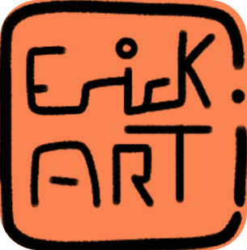

  

<h1 align="center">
  
</h1>

## About The Project
Carefully developed landing page, with the specific purpose of displaying and highlighting the magnificent work carried out by the client in order to attract more individuals.

### Built With

* [![React][React.js]][React-url]
* ![Typescript]
* ![HTML]
* ![CSS]
* ![STYLED]
* [![Bootstrap][Bootstrap.com]][Bootstrap-url]

## Contact

Eli Barros - [Linkedin](https://www.linkedin.com/in/cleitonbarrosmoura/)

Project Link: [ErickArti](erickalvezartstudio.vercel.app)

## License

Distributed under the MIT License. See `[LICENSE.txt]` for more information.

[React.js]: https://img.shields.io/badge/React-20232A?style=for-the-badge&logo=react&logoColor=61DAFB
[React-url]: https://reactjs.org/

[HTML]: https://img.shields.io/badge/HTML5-E34F26?style=for-the-badge&logo=html5&logoColor=white
[CSS]: https://img.shields.io/badge/CSS3-1572B6?style=for-the-badge&logo=css3&logoColor=white

[Bootstrap.com]: https://img.shields.io/badge/Bootstrap-563D7C?style=for-the-badge&logo=bootstrap&logoColor=white
[Bootstrap-url]: https://getbootstrap.com

[Typescript]: https://img.shields.io/badge/TypeScript-007ACC?style=for-the-badge&logo=typescript&logoColor=white
[STYLED]: https://img.shields.io/badge/styled--components-DB7093?style=for-the-badge&logo=styled-components&logoColor=white

